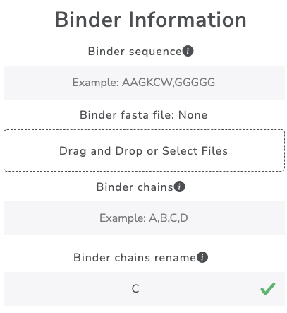
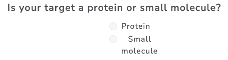
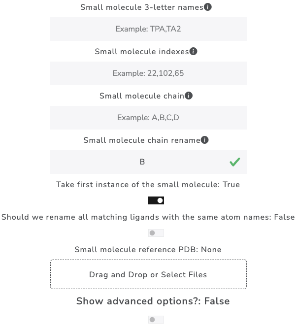
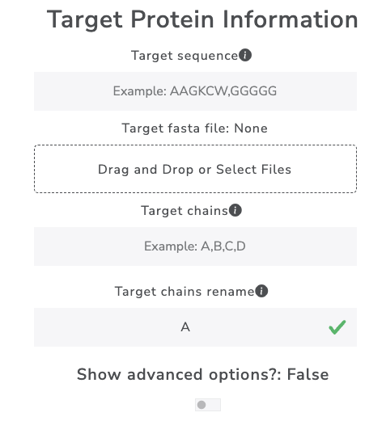
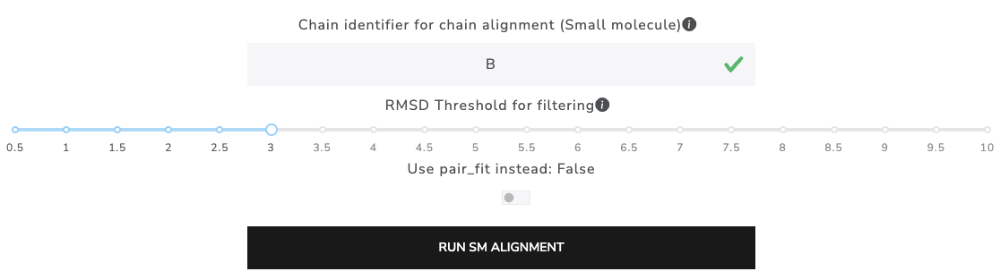
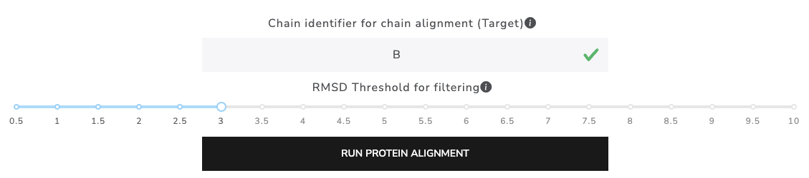
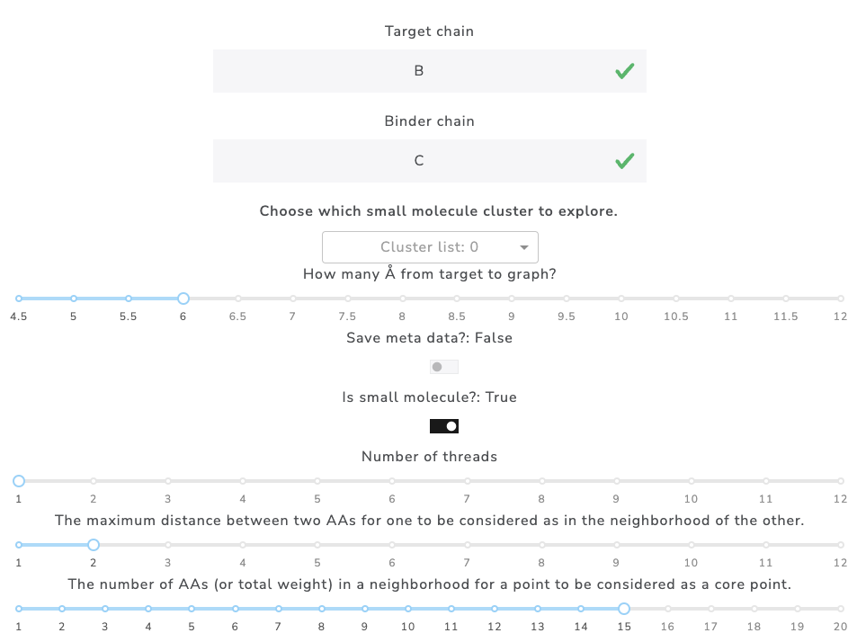
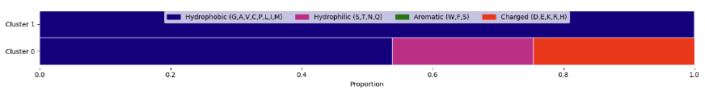
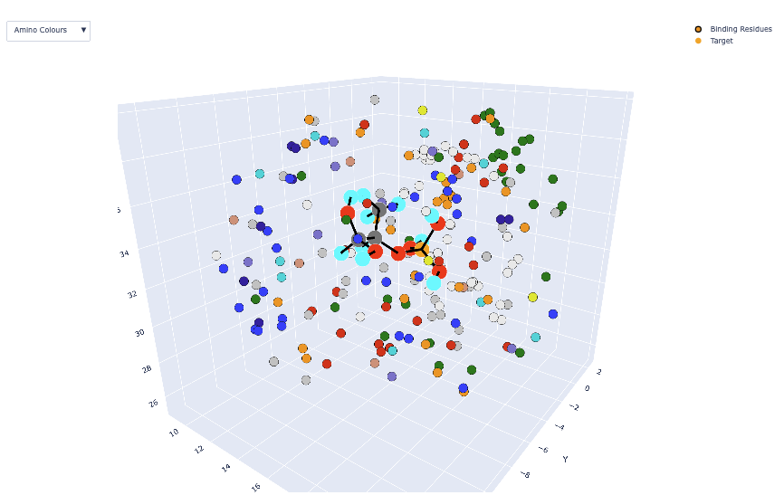
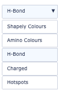

================================
Using the MAGPIE GUI
================================

I. Running the MAGPIE GUI on your local machine
================================================

MAGPIE is available for use as a `GUI <https://magpie-production.up.railway.app/>`_. Like the Local-Version of MAGPIE, the MAGPIE GUI can be run on your local machine.

Click `here <https://github.com/glasgowlab/MAGPIE/tree/GUI>`_ to navigate to the MAGPIE GUI branch on github.

A. Run the MAGPIE GUI server locally: 
--------------------------------------------------------
1. Set up the MAGPIE GUI environment
--------------------------------------

.. code-block:: bash

    git clone git@github.com:glasgowlab/MAGPIE.git
    cd MAGPIE
    git checkout GUI
    conda env create -f environment.yml
    conda activate MAGPE_GUI
   
2. Run the MAGPIE GUI server locally
--------------------------------

.. code-block:: bash

    python server_local.py

The GUI will be opened in your web browser and is ready to use. All files it creates will be in the current working directory.

I. Getting Started with the MAGPIE GUI
========================================

0. Click the button to start uploading your data to the GUI server: 
------------------------------------------------------------------------------------

1. Upload a zipfile containing the PDBs to be MAGPIED
-------------------------------------------------------

2. MAGPIE input Prep
--------------------------------------

**Enter values to perform the input prep including binder sequence, binder fasta file, and binder chains. It is also possible to rename your binder chain:**

   

**Select whether your target is a protein or small molecule:**

*If desired, toggle the switch to show advanced options:*

For more information on advanced options, see the supplementary material in the MAGPIE paper: `Rodriguez et al. 2021 <https://doi.org/10.1101/2021.06.29.450229>`_.

A. Enter target small molecule information:
--------------------------------------------

*If desired, toggle the switch to show advanced options:*

B. Enter target protein information:
-------------------------------------

*If desired, toggle the switch to show advanced options:*

**Click the RUN MAGPIE INPUT PREP button:**

3. Molecule alignment or Protein alignment: 
--------------------------------------------

A. Enter values to perform small alignment and clustering:
----------------------------------------------------------

B. Enter values to perform protein alignment and clustering:
--------------------------------------------------------------

4. MAGPIE it!
--------------

**Click the Plot points in 3D viewer button:**

*Example DBSCAN cluster output*

*Example 3D viewer output*

To toggle between 3D viewer settings (Shapely colors, amino colors, H-bonds, charged residues, and DBSCAN hotspots): 

To toggle between molecule views: 

Download data: 
 

