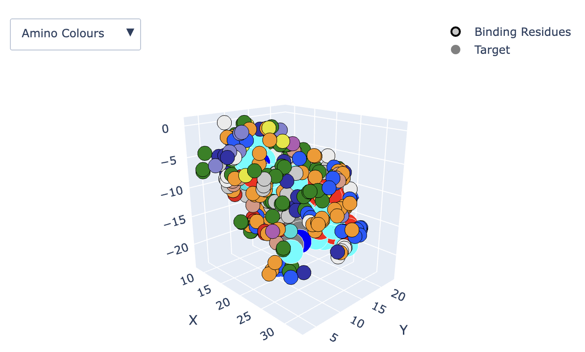
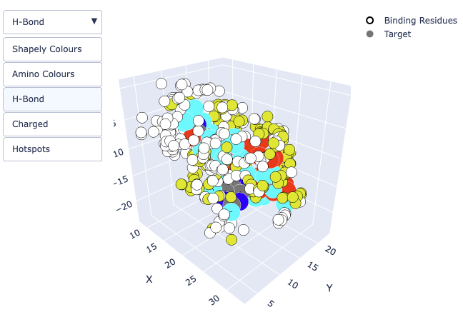
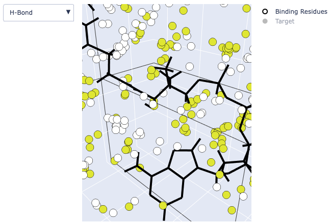
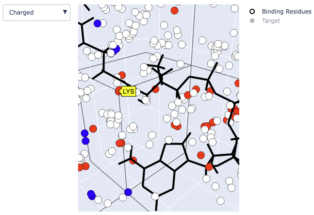
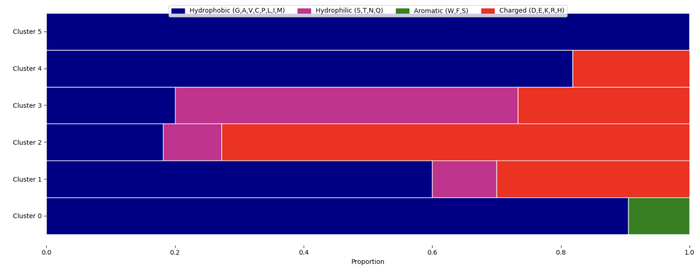

=================================
Using MAGPIE with GoogleColab
=================================

The `MAGPIE GoogleColab server <https://colab.research.google.com/github/glasgowlab/MAGPIE/blob/GoogleColab/MAGPIE_COLAB.ipynb>`_ provides a free cloud-based Python environment that includes all the necessary packages to run MAGPIE without downloading the MAGPIE package onto their local machine. The GoogleColab server can be used to run pre-loaded example datasets and also provides an interface for users to upload and run their own datasets.

Required Inputs
================
For more detail on the required inputs for MAGPIE, see the `Required Inputs <https://magpie-docs.readthedocs.io/en/latest/Inputs.html>`_ section of this documentation.

Usage
=======
Please execute the cells in numerical order. To execute a cell, click the play button. If you wish to load a different dataset, start from the upload step to reload the new data.

**Tutorials with pre-loaded dataset and user-uploaded datasets are provided below.**

Tutorial Introduction
======================

Note: The PDB files in the pre-loaded dataset (used below in this tutorial) and the example user-uploaded dataset (in the `Preparing your own dataset for use in MAGPIE <https://magpie-docs.readthedocs.io/en/latest/Preparing_samples.html>`_ section of this documentation) are the same. However, in the pre-loaded dataset tutorial here, the PDBs have already been pre-processed by the MAGPIE helper scripts, whereas in the user-uploaded dataset tutorial, you will learn how to pre-process the PDBs using the MAGPIE helper scripts.

The coenzyme A (COA) dataset from case study #2 of `Rodriguez et al. 2023 <https://www.biorxiv.org/content/10.1101/2023.09.04.556273v2>`_ will be used in these tutorials. We used 199 structurally diverse bacterial enzymes that bind COA. We searched the PDB for structural models with refinement resolutions between 1.5 and 3 Å using its PubChem identifier code 87642. From this set of >600 structures, to reduce redundancy and noise in the dataset, we chose 199 models randomly. Using MAGPIE_input_prep.py with the small molecule target ligand name and mesh area search selection options, we removed all other chains that were not COA or the protein(s) bound/nearby to COA, including redundant protein and COA chains.

GoogleColab Tutorial with pre-loaded dataset
=============================================
This tutorial will guide you through using MAGPIE on the small_molecule_ligand_example dataset (case study #2). This dataset has already been cleaned, standardized, and aligned on the target ligand, and can be loaded directly into MAGPIE in Step 2. 

Each cell in the Jupyter notebook should be run in order by pressing the play button on the left of the cell. The notebook is divided into sections, each of which performs a specific task.

0. Open the GoogleColab server
--------------------------------
Open the GoogleColab server `here <https://colab.research.google.com/github/glasgowlab/MAGPIE/blob/GoogleColab/MAGPIE_COLAB.ipynb>`_

1. Install and import required packages
----------------------------------------

2. Upload and process data
----------------------------

Check the box next to the small_molecule_ligand example to select this dataset. This will import the dataset from the GitHub repository and load it into MAGPIE GoogleColab.

3. Select target ligand and protein binder chains
--------------------------------------------------

3.1 Select the target ligand and protein binder chains from the dropdown menu. The target ligand chain is the chain identifier of the target ligand in the PDB file. The protein binder chain is the chain identifier of the protein binder in the PDB file. For the small molecule target example, use B for the target chain and C for the protein binder chain. 

3.2 Check the is_ligand option if the target ligand is a small molecule.

3.3 Provide the distance in Angstroms to graph from the target chain. 

**MAGPIE uses**  `DBSCAN <(https://www.dbs.ifi.lmu.de/Publikationen/Papers/KDD-96.final.frame.pdf)>`_  **to cluster points in 3D without requiring to specify the number of desired clusters (Optional).**

*3.4 Optional:* To run the DBSCAN feature of MAGPIE run the DBSCAN cells, choose the eps and min_samples parameters, and run the DBSCAN cells.

**eps:** The maximum distance between two samples for one to be considered as in the neighborhood of the other.

**min_samples:** The number of samples (or total weight) in a neighborhood for a point to be considered as a core point. Default is eps = 2.0, min_samples = 15.

4. Plot points in 3D viewer
----------------------------

This might take a couple of minutes depending on the size of the dataset.

*Example output of the 3D viewer showing Amino colors.*

Use the options on the top right of the window to zoom, pan, and rotate the 3D viewer (this can also be done with your mouse/trackpad):

The dropdown menu on the top left of the screen allows you to color the 3D graph by Shapely colors, amino colors, H-bonds, and DBSCAN hotspots:

*Example output of the 3D viewer showing Hydrogen bonds and target molecule. Notice that the target molecule is colored by atom (the "Target" option on the right side of the screen is checked).*

Unchecking the "Target" option will show the molecule as sticks (atom colors are hidden):

It is also possible to hide the binding residues by unchecking the "Binding Residues" option or to hide the targt molecule by unchecking "Target."

View the names of each atom in the small molecule by hovering over the atoms in the small molecule. Hovering over binding residues will show the residue name when viewing Shapely Colours, Amino Colors, and Hydrogen Bonds and show the cluster number when viewing DBSCAN Hotspots.

*Example output of the 3D viewer showing charged residues. Positively charged residues are shown in red; Negatively charged residues are shown in blue.*

4.2 Plot clusters 
------------------
Run this cell if you are using the DBSCAN capability (Optional). Images can be downloaded by right clicking on the image and selecting "Save Image As."

*Example output of the Plot DBSCAN clusters cell.*

5. Select target ligand residues or heavy atoms 
------------------------------------------------

Enter the target residue indices or heavy atom names to graph. These should be separated by commas, without spaces (e.g., N1A,N3A,N9A). Ranges are allowed when working with protein-protein interactions (e.g. 127-131,146-149). If there are no residues within the given range, the next cell will not execute.

For this example, you can input N4P,N8P,N9A,N6A:

6. Generate AA frequency graphs
--------------------------------

Run this cell to generate the AA frequency graphs for the target residues or heavy atoms. Check the "combined" box to only display the combined AA frequency graph. Images can be downloaded by right clicking on the image and selecting "Save Image As."

Unchecking the "combined" box will output: 

1. The combined AA frequency graph (residues in contact)

2. The combined H-Bonds frequency graph 

3. The combined AA frequency graphs and H-bond graphs for each heavy atom or target residue. 

.. image:: _static/COA_Freq.png
*Example combined frequency graph (residues in contact)*

**For a tutorial on how to use MAGPIE with user-uploaded datasets, please the** `Preparing your own dataset for use in MAGPIE <https://magpie-docs.readthedocs.io/en/latest/Preparing_samples.html>`_ **section of this documentation.**