================================
Using MAGPIE with Local-Version
================================

The Local-Version of MAGPIE can be downloaded from github and run on a local machine. This version of MAGPIE is recommended for users who wish to keep their data private, or have >1000 input PDB files. The Local-Version of MAGPIE requires the user to have Python 3 installed on their machine, as well as the following Python packages: Numpy (1.18.5), Pandas (1.3.4), Matplotlib (3.4.3), Glob (0.7), Plotly (5.9.0), and Spicy (1.7.1). The Local-Version of MAGPIE can be downloaded from the `MAGPIE Github repository <https://github.com/glasgowlab/MAGPIE/tree/local-version>`_.

I. Install Dependencies
========================

Before installing MAGPIE, install the following packages from your package
repository:

1. Python 3
2. Pip

Click `here <https://www.python.org/downloads/>`_ for more information on how to install Python

Click `here <https://pip.pypa.io/en/stable/installation/>`_ for more information on how to install pip. 

II. Download Code
================

The MAGPIE Local-Version package, tutorials, and associated scripts are available for download
from the `GitHub repository <https://github.com/glasgowlab/MAGPIE>`_. There
are several options for doing so.

A. Use Git
----------

If you have `git` installed on your system, you can use it to clone the
repository from GitHub. 

cd into the directory where you would like to download the code.
From the command line, run:

.. code-block:: bash

   cd /path/to/directory
   git clone -b local-version https://github.com/glasgowlab/MAGPIE.git

The code will now be downloaded in a new directory called `MAGPIE`.

B. (OR) Download from the Website
---------------------------------

Though not recommended, you can also download the source code from the GitHub
website. Click the green "Clone or download" tab to obtain the
latest code.

.. image:: _static/Github_download.png

III. Getting Started with MAGPIE Local-Version
============================================

The Local-Version of MAGPIE is a standalone version of the MAGPIE code that can be run on a local machine.  

It is always recommended that you create a conda environment for any project you are working on. This will help you to keep your dependencies separate from other projects. To create a new conda environment with python 3.7 (for example), run the following command:

.. code-block:: bash

   conda create -n magpie python=37

To activate the environment, run:

.. code-block:: bash

   conda activate magpie

Running MAGPIE Local-Version requires installation of Jupyter notebooks (1.0.0). For more on how Jupyter notebooks work, see: `<https://jupyter.org>`_.

To install Jupyter notebooks, run the following command within your conda environment:

.. code-block:: bash

   pip install jupyter

MAGPIE also requires the following Python packages and versions to run the local version, which can be downloaded via pip in your conda environment:
   1. Numpy (1.18.5)
   2. Pandas (1.3.4)
   3. Matplotlib (3.4.3)
   4. Glob (0.7)
   5. Plotly (5.9.0)
   6. Spicy (1.7.1)

For example, to download the Pandas package with pip run: 

.. code-block:: bash

   pip install pandas

To begin running the MAGPIE Local-Version, navigate to the directory where you downloaded the code and switch to the Local-Version branch (if you aren't already in that branch). Then open a Jupyter notebook. To do this, run the following commands:

.. code-block:: bash

   cd /path/to/MAGPIE
   git checkout local-version
   jupyter notebook

This will open jupyter notebooks in your browser 

.. image:: _static/MAGPIE_Jupyter_nb.png

Click on the MAGPIE_LOCAL.ipynb file to open the local-version jupyter notebook in your browser.

**The Local-Version of MAGPIE can now be used on your local machine via Jupyter notebook.**

Required Inputs
================
For more detail on the required inputs for MAGPIE, see the "Required Inputs" section of this documentation.

Tutorial Introduction
======================

This tutorial will guide you through using MAGPIE with the Small molecule example dataset (case study #2). This dataset has already been cleaned, standardized, and aligned on the target ligand, and can be loaded directly into MAGPIE in Step 2.

The coenzyme A (COA) dataset from case study #2 of `Rodriguez et al. 2023 <https://www.biorxiv.org/content/10.1101/2023.09.04.556273v2>`_ will be used in these tutorials. We used 199 structurally diverse bacterial enzymes that bind COA. We searched the PDB for structural models with refinement resolutions between 1.5 and 3 Å using its PubChem identifier code 87642. From this set of >600 structures, to reduce redundancy and noise in the dataset, we chose 199 models randomly. Using MAGPIE_input_prep.py with the small molecule target ligand name and mesh area search selection options, we removed all other chains that were not COA or the protein(s) bound/nearby to COA, including redundant protein and COA chains.

Local-Version tutorial with pre-loaded datasets
===============================================

Each cell in the Jupyter notebook should be run in order. The notebook is divided into sections, each of which performs a specific task.

0. Open the MAGPIE Local-Verison Jupyter notebook as described above
---------------------------------------------------------------------
1. Run required packages, then upload and process data
-------------------------------------------------------

Upon running this cell, the user will be asked to input a path to the cleaned dataset. The dataset will then be loaded into MAGPIE.

To run the small molecule example dataset, input 'Small molecule example/reference_1' into the input box. This will load conformer pool 1 of the COA dataset.

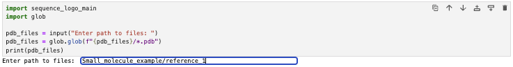

2. Select target ligand and protein binder chains
--------------------------------------------------

Upon running this cell, users will be asked to input the target chain, binding chain, whether the molecule is a small-molecule ligand (True or False), the distance to graph from the target chain in Angstroms, and whether to store the metadata. 

For the small molecule target example, use B for the target chain and C for the protein binder chain, True for small molecule, and choose a RMSD threshold. 

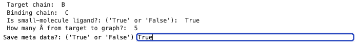

3.1. Advanced Options
----------------------

**Clustering**

*MAGPIE uses*  `DBSCAN <(https://www.dbs.ifi.lmu.de/Publikationen/Papers/KDD-96.final.frame.pdf)>`_  *to cluster points in 3D without requiring to specify the number of desired clusters (Optional).*

To run the DBSCAN feature of MAGPIE run the DBSCAN cells, choose the eps and min_samples parameters, and run the DBSCAN cells.

    **eps:** The maximum distance between two samples for one to be considered as in the neighborhood of the other.

    **min_samples:** The number of samples (or total weight) in a neighborhood for a point to be considered as a core point. Default is eps = 2.0, min_samples = 15.
   
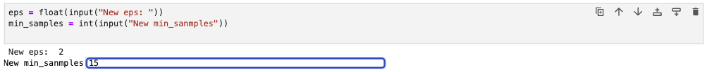

**Multithreading**

MAGPIE uses multiprocessing to multithread using CPUs. Unless you run the following cell, MAGPIE will use 1 thread.

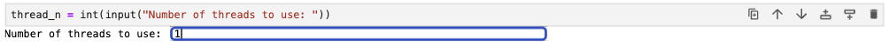

3.2 Plot points in 3D Viewer
-----------------------------

Running this cell will open a new window in your browser displaying the 3D viewer. This viewer will display the target ligand/protein and protein binder chains.

This might take a couple of minutes depending on the size of the dataset.

Note: If you are using this jupyter notebook in an IDE (ie. VSCode, PyCharm, etc.) the 3D viewer will not display. Instead, an html file will be saved in the directory where the jupyter notebook is located. You can open this html file in your browser to view the 3D viewer.

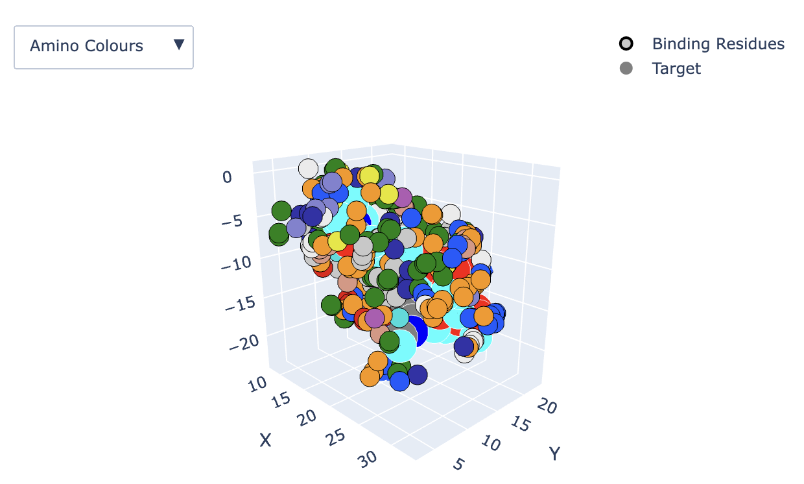
*Example output of the 3D viewer showing Amino colors.*

Use the options on the top right of the window to zoom, pan, and rotate the 3D viewer (this can also be done with your mouse/trackpad):

The dropdown menu on the top left of the screen allows you to color the 3D graph by Shapely colors, amino colors, Charge, H-bonds, and DBSCAN hotspots:

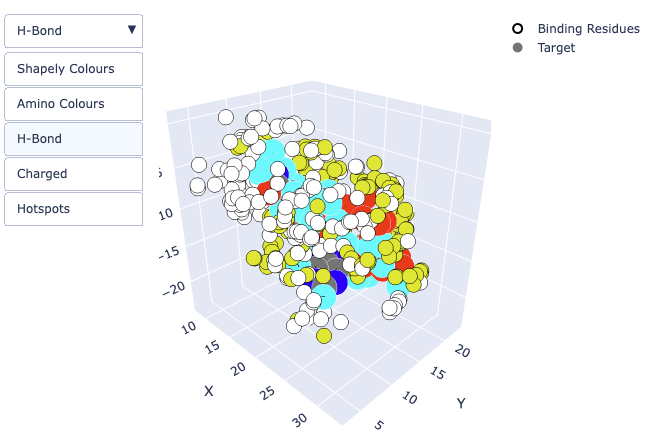
*Example output of the 3D viewer showing Hydrogen bonds *yellow* and target molecule. Notice that the target molecule is colored by atom (the "Target" option on the right side of the screen is checked).*

Unchecking the "Target" option will show the molecule as sticks (atom colors are hidden):

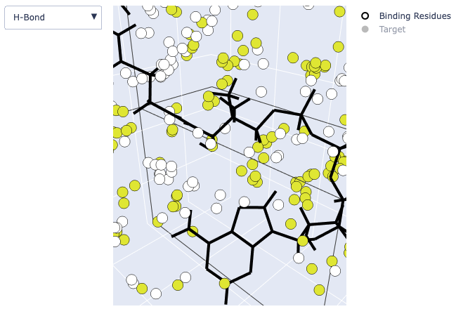

*It is also possible to hide the binding residues by unchecking the "Binding Residues" option or to hide the target molecule by unchecking "Target."*

View the names of each atom in the small molecule by hovering over the atoms in the small molecule. Hovering over binding residues will show the residue name when viewing Shapely Colours, Amino Colors, Charge, and Hydrogen Bonds and show the cluster number when viewing DBSCAN Hotspots:

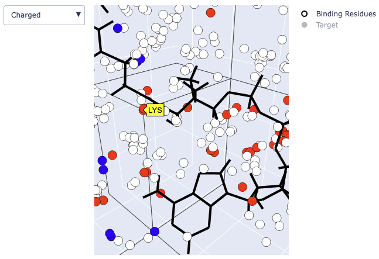
*Example output of the 3D viewer showing charged residues.*

If you are using the MAGPIE's DBSCAN capability a figure of the DBSCAN clusters will be displayed in the jupyter notebook

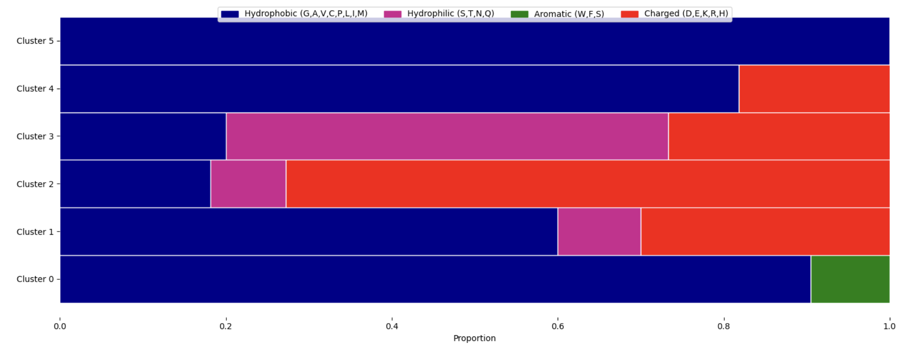

4. Select target ligand residues or atoms to generate AA frequency graphs
--------------------------------------------------------------------------

Enter the target residue indices or heavy atom names to graph. These should be separated by commas, without spaces (e.g., N1A,N3A,N9A). Ranges are allowed when working with protein-protein interactions (e.g., 127-131,146-149). If there are no residues within the given range, the next cell will throw an error.

For this tutorial, you can input N4P,N8P,N9A,N6A

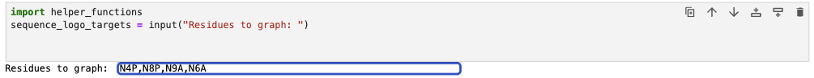

5. Generate AA frequency graphs
--------------------------------

Run this cell to generate the AA frequency graphs for the target residues or heavy atoms. Check the box to only display the combined AA frequency graph.

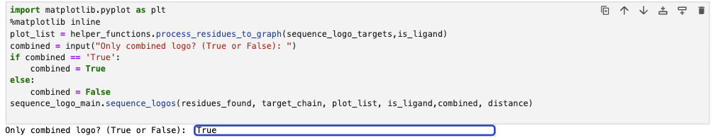

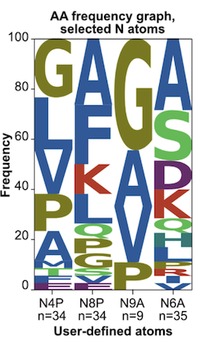

**For a tutorial on how to use MAGPIE with user-uploaded datasets, please the 'Preparing your own dataset for use in MAGPIE' section of this documentation.**