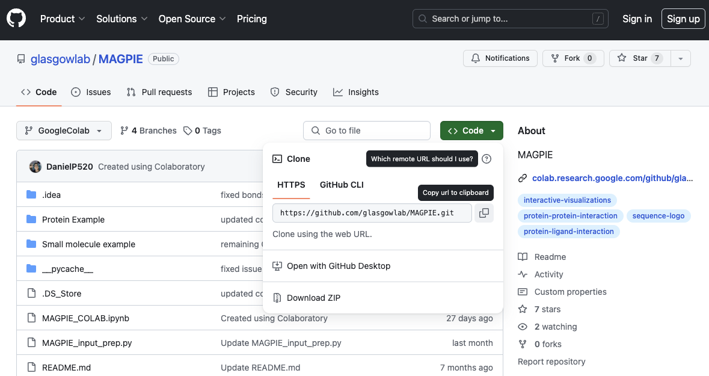
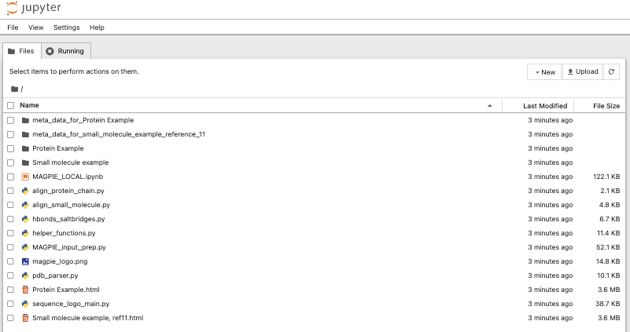

Using MAGPIE with Local-Version
================================

The following are a set of command-line-centric instructions for installing
the Local-Version of MAGPIE on Linux, Windows, and macOS operating systems.

1. Install Dependencies
========================

Linux 
-----

Before installing pySCA, install the following packages from your package
repository:

1. Python 3
2. Pip
3. GCC

.. code-block:: bash

   sudo apt-get install python3 python3-pip git gcc

Windows
-------

macOS
-----

2. Download Code
================

The MAGPIE Local-Version package, tutorials, and associated scripts are available for download
from the `GitHub repository <https://github.com/glasgowlab/MAGPIE>`_. There
are several options for doing so.

A. Use Git
----------

If you have `git` installed on your system, you can use it to clone the
repository from GitHub. 

cd into the directory where you would like to download the code.
From the command line, run:

.. code-block:: bash

   cd /path/to/directory
   git clone https://github.com/glasgowlab/MAGPIE.git

The code will now be downloaded in a directory called `MAGPIE`.

B. (OR) Download from the Website
---------------------------------

Though not recommended, you can also download the source code from the GitHub
website. Click the green "Clone or download" tab to obtain the
latest code.

3. Getting Started with MAGPIE Local-Version
============================================

The Local-Version of MAGPIE is a standalone version of the MAGPIE code that can be run on a local machine.  

It is always recommended that you create a conda environment for any project you are working on. This will help you to keep your dependencies separate from other projects. To create a new conda environment, run the following command:

.. code-block:: bash

   conda create -n magpie python=3.7

To activate the environment, run:

.. code-block:: bash

   conda activate magpie

Running MAGPIE Local-Version requires installation of Jupyter notebooks (1.0.0). For more on how Jupyter notebooks work, see: `<https://jupyter.org>`_.

To install Jupyter notebooks, run the following command within your conda environment:

.. code-block:: bash

   pip install jupyter

MAGPIE also requires the following Python packages and versions to run the local version, which can be downloaded via pip in your conda environment
Numpy (1.18.5)
Pandas (1.3.4)
Matplotlib (3.4.3)
Glob (0.7)
Plotly (5.9.0)
Spicy (1.7.1)

To begin running the MAGPIE Local-Version, navigate to the directory where you downloaded the code and switch to the Local-Version branch. Then open a Jupyter notebook by running the following command:

.. code-block:: bash

   cd /path/to/MAGPIE
   git checkout Local-Version
   jupyter notebook

This will open a jupyter notebook in your browser 

