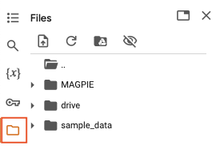
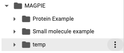
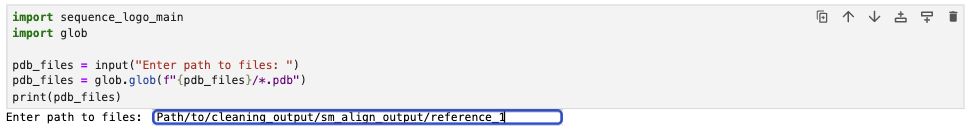

============================================
Preparing your own dataset for use in MAGPIE
============================================

To use your own PDB files with MAGPIE GoogleColab or Local-Version, you will need to clean, standardize, and align the input PDB files, by using helper scripts ``MAGPIE_input_prep.py``, ``align_protein_chain.py``, and ``align_small_molecule.py`` which can be downloaded from the `GitHub repository <https://github.com/glasgowlab/MAGPIE>`_ if you are using the GoogleColab version of MAGPIE. If you have downloaded the Local-Version of MAGPIE, these scripts are included in the downloaded repository. Use of the MAGPIE helper scripts requires python to be installed on your local machine. For information on how to install Python, please visit `https://www.python.org/downloads/ <https://www.python.org/downloads/>`_.

Overview of MAGPIE helper scripts
==================================
``MAGPIE_input_prep.py`` allows the user to input files or directories with options to define target ligands and protein binders by chain, protein sequence (with percent sequence identity), ligand name (for small molecule targets), and search radius around the target. The alignment scripts align the protein-ligand complexes on the target ligand for use with MAGPIE, returning subsets of complexes for small molecule ligands as determined by user-defined all-atom RMSD. 

``align_protein_chain.py`` is an alignment script for structural models with target ligands that are proteins. This alignment script will align the protein binders on the target protein chain for use with MAGPIE, returning subsets of complexes for protein ligands as determined by user-defined alpha carbon RMSD. 

``align_small_molecule.py`` is an alignment script for structural models with target ligands that are small molecules. This alignment script will align the protein-ligand complexes on the target ligand for use with MAGPIE, returning subsets of complexes for small molecule ligands as determined by user-defined alpha carbon RMSD.

**For more information on the arguments of each helper script see the "Helper Scripts" section of this documentation.**

Tutorial
=========
**0. Unzip the dataset**

In this tutorial, we will process the the PDBs from the small_molecule_example dataset for use in MAGPIE. Unzip the provided dataset ("MAGPIE_COA_Dataset_Tutorial.zip"). 

Activate your conda environment 

.. code-block:: bash

    conda activate <your conda environment with MAGPIE packages>

1. Run ``MAGPIE_input_prep.py``
----------------------------------

 This helper script takes an input PDB file or directory of PDB files, an output directory, and identifying information about the protein binders and the target ligands. It outputs reformatted, renumbered PDB files in which the protein binder is on one chain and the target ligand is on another chain. The output files are found in the user-specified output directory with the suffix “_cleaned.pdb”.

 Make a directory for the cleaned output files 

.. code-block:: bash
    
        mkdir <path to output directory>

Run the ``MAGPIE_input_prep.py``. This will take a few minutes depending on the size of your dataset. The MAGPIE_COA_Dataset_Tutorial directory contains 198 files and takes around 9 minutes to run.

.. code-block:: bash

    python ~/MAGPIE/MAGPIE_input_prep.py -i <path to MAGPIE_COA_Dataset> -o <path to output directory> -L COA -M 'A,B;;COA;'

2. Run align ``align_small_molecule.py`` or ``align_protein_chain.py``
-----------------------------------------------------------

We will use the ``align_small_molecule.py`` helper script for this tutorial. However, an example command line for the ``align_protein_chain.py`` script is also provided.

**A.** ``align_small_molecule.py``

The structures are then globally aligned on COA using ``align_small_molecule.py``. All structures are exported as individual PDB files and sorted into conformer bins based on the threshold you provide -- View the pdb files of each conformer bin in a molecule viewer ie. PyMol to determine if your input threshold is sufficient for your use case. If your output directory does not exist, the script will make an output directory for you with the path you provide.

.. code-block:: bash

    python ~/MAGPIE/align_small_molecule.py -c B -T 2.5 -i <path to cleaned files> -o <path to output_directory for step 3A> -p True

An RMSD threshold of 2.5 Angstroms is used here.

If the pair_fit argument(-p) is set to True, the function will use the pair_fit command for alignment, which aligns two objects based on a set of atom pairs. This can be useful when the atom names or numbers differ too much between the two structures. 

This script will take some time to run (>10 min for this dataset)

**B.**  ``align_protein_chain.py``

The protein binders can be aligned on the target ligand using ``align_protein_chain.py``. All structures are exported as individual PDB files. An RMSD threshold of 2.5 Angstroms is used here.

.. code-block:: bash

    python ~/MAGPIE/align_protein_chain.py -c B -T 2.5 -i <input_directory> -o <output_directory>

*This script will not be run in this tutorial but the command line is provided for reference.*

3. Import aligned PDB files into MAGPIE GoogleColab
---------------------------------------------------

**A. GoogleColab Version**

**3.1** Open the GoogleColab server `here <https://colab.research.google.com/github/glasgowlab/MAGPIE/blob/GoogleColab/MAGPIE_COLAB.ipynb>`_

**3.2** Navigate to the File menu located top left of the screen. 

**3.3** Upload data into the temp directory, in the form of a compressed directory in .zip format containing the PDB input files:

Click the three dots on the right side of the file "temp" to upload the zip file:

*It is also posible to directly upload the PDB files into the temp folder, but this might take a long time depending on the number of files.*

**3.4** Proceed to run the rest of the jupyter notebook as described in the MAGPIE GoogleColab tutorial.

**B. Local-Version**

**3.0** Activate your MAGPIE environment and cd to the local MAGPIE directory

.. code-block:: bash

    conda activate <your conda environment with MAGPIE packages>
    cd <path to MAGPIE directory>

**3.1** Open the MAGPIE Local-Version directory jupyter notebooks

.. code-block:: bash

    jupyter notebook

Click on the MAGPIE_LOCAL.ipynb file to open the MAGPIE local-version jupyter notebook

**3.2** Run the Local-Version jupyter notebook. Run the first cell and provide the path to the directory containing the aligned PDB files. 

**3.3.** Proceed to run the rest of the jupyter notebook as described in the MAGPIE Local-Version tutorial.

